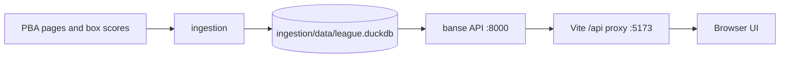

# Adbansed Stats

Basketball statistics for Philippine leagues. The current dataset is the PBA
50th Season Governors' Cup. The project is split into four directories under
`repos/`:

| Directory | Role |
| --- | --- |
| [`ingestion`](repos/ingestion/README.md) | Python retrieval, cleaning, identity matching, and storage. It writes the DuckDB database. |
| [`banse`](repos/banse/README.md) | Read only FastAPI service. It queries the DuckDB database and returns tournament, team, player, game, and box score data. |
| [`ui`](repos/ui/README.md) | TypeScript and Vite website. It requests data from Banse and renders the home, statistics, player, team, and game pages. |
| `datasource/pba` | Standalone PBA box score export/debug script. It uses the ingestion parser but is not needed to run the API or website. |



Ingestion runs when you want to add or update data. Banse only reads the database;
the UI never opens DuckDB directly. During local development, Vite forwards browser
requests for `/api` to Banse at `http://127.0.0.1:8000`. Banse currently serves
DuckDB, although ingestion can also write SQLite. The data directory is local and
ignored by Git, so a fresh clone needs an ingestion run or a copy of the database.

## Run the current data locally

The database is already populated on this machine. Run these commands from the
project root in **two separate terminals**.

### 1. Start Banse

Use Python 3.10 or newer. This machine has Homebrew Python 3.14; the default
`python3` may instead be Anaconda Python 3.9, which cannot install Banse.

```sh
cd repos/banse
python3.14 --version
python3.14 -m venv .venv          # first time only
source .venv/bin/activate
python --version                 # should show 3.14.x
python -m pip install -e .      # first time, or after dependency changes
banse --database ../ingestion/data/league.duckdb
```

If `.venv` was previously made with Python 3.9, run
`python3.14 -m venv --clear .venv` in `repos/banse` before activating it. A pip
upgrade warning is unrelated to the Python version error. Keep this terminal
running. Check the API at <http://127.0.0.1:8000/api/tournaments> or explore
its interactive docs at <http://127.0.0.1:8000/docs>.

### 2. Start the UI

Vite needs Node.js 22.12 or newer. The default `/usr/local/bin/node` on this
machine is version 16.16.0. A temporary Node 22 binary is available from the
previous setup, so the following works while that `/tmp` directory exists:

```sh
export PATH="/tmp/banse-node/node_modules/node/bin:$PATH"
node --version                    # should show v22.23.3
cd repos/ui
npm install                       # first time, or after dependency changes
npm run dev
```

Open the local address printed by Vite, usually <http://localhost:5173>.
For a lasting setup, install Node 22.12+ with your preferred version manager and
ensure `node --version` reports it before running `npm run dev`; the `/tmp` copy
can disappear after a restart.

## Update the data

The detailed PBA retrieval and import steps are in the
[`ingestion` guide](repos/ingestion/README.md). The current UI and API display
only games that have been imported into `league.duckdb`. To see newly completed
games, run ingestion again against that database, then reload the UI. If DuckDB
reports a file lock, stop Banse during the import and restart it afterward.
